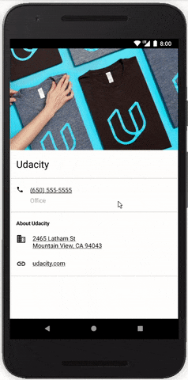

<h1 align="center">Hello Android</h1>

<strong>Contact card with phone, map and web autolinks</strong>
 This is my first interactive app 😎✌️

 

</img>

<h2>About</h2>
Second of eight student projects made in 2017-2018 as part of <a href="https://eu.udacity.com/course/android-basics-nanodegree-by-google--nd803" target="_blank">Udacity's Android Basics Nanodegree</a>.

<h3>☑️ Phase 1 - (Nov. - Feb.):</h3>

1. <a href="https://github.com/r4dixx/LiterallyHelloWorld">Literally Hello World</a>
2. <a href="https://github.com/r4dixx/HelloAndroid" target="_blank"><strong>Hello Android</strong></a>
3. <a href="https://github.com/r4dixx/CheesyWinterContest" target="_blank">Cheesy Winter Contest</a>
4. <a href="https://github.com/r4dixx/m32O" target="_blank">m32O</a>

<h3>☑️ Phase 2 - (Feb. - Jul.):</h3>

 1. <a href="https://github.com/r4dixx/RookiePlayer">Rookie Player</a>
2. <a href="https://github.com/r4dixx/VisitCalgary">Visit Calgary</a>
3. <a href="https://github.com/r4dixx/TheGuardianView">The Guardian View</a>
4. <a href="https://github.com/r4dixx/Flourish-And-Blotts-Book-Registry">Flourish & Blotts - Book Registry</a>

<h2>Goal and requirements</h2>

Build a single screen app that displays information about Udacity. 

Project must include business name, business address and phone number. Illustration is mandatory. Website is optional. Code wise, at least one ViewGroup is included, XML must include a RelativeLayout or LinearLayout and ViewGroups contain at least one ImageView and one TextView.

<h2>Key learnings</h2>

- Relative layout
- Autolinks
- Separator lines
- Material icons
- Content descriptions

Project has been improved at the end of Phase 1 given the new learnings acquired then.

<h2>Installation</h2>

1. Download this project as zip and extract it
2. Import it in Android Studio
3. Sync Gradle and run on your device/emulator

Or use <a href="https://github.com/cesarferreira/dryrun" target="_blank">`dryrun`</a> by <a href="https://github.com/cesarferreira" target="_blank">@CesarFerreira</a>

<h2>Contributing</h2>

This project is open to suggestions and improvements. Simply create a Pull Request and I'll have a look.

<h2>Project status</h2>
Open to translation and code suggestions. Closed feature-wise.

<h2>Credits</h2>

- Author: <a href="https://twitter.com/r4dixx" target="_blank">Amaël Sikel</a>
- Icon made from Udacity's logo
- Colors from Udacity's color scheme

<h2>Copyright</h2>
This project is licensed under the terms of the MIT license and protected by Udacity Honor Code and Community Code of Conduct. See <a href="LICENSE.md">license</a> and <a href="LICENSE.DISCLAIMER.md">disclaimer</a>.
